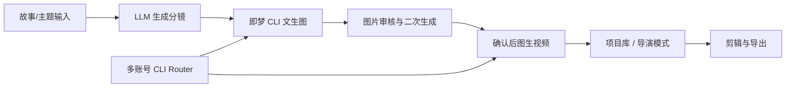

# 即梦AI视频CLI工作流

把即梦 CLI 变成桌面端 AI 视频生产线。

`即梦AI视频CLI工作流`（Jimeng AI Video CLI Workflow）是一款面向 AI 短剧、漫剧和分镜视频创作者的桌面生产工具。它把 OpenAI 兼容 LLM、即梦官方 `dreamina` CLI、图片审核重生成、图生视频、多账号积分调度和轻量剪辑整合到一个可视化工作台中，让创作者从故事想法一路推进到可导出的初剪视频。

> 非官方项目：本项目不是即梦、剪映、字节跳动的官方产品。使用前请自行安装并登录即梦官方 `dreamina` CLI，遵守相关平台条款和素材版权要求。

## 产品定位

**一个桌面应用，完成“故事想法 -> 分镜脚本 -> 分镜图 -> 图生视频 -> 初剪导出”的完整 AI 视频流水线。**

## 面向用户

- AI 漫剧、短剧、分镜视频创作者
- 批量测试即梦图片/视频提示词的内容团队
- 已经在使用 `dreamina` CLI，但希望减少命令行切换、账号切换和文件整理成本的用户
- 想把 LLM 分镜和即梦生成串成半自动生产流程的开发者

## 核心价值

- **把 CLI 能力产品化**：保留即梦 CLI 的本地调用方式，用桌面界面承接项目管理、生成状态、素材预览和导出。
- **先审图，再生视频**：图片生成后进入独立审核阶段，支持查看大图、改提示词、二次生成，确认后再消耗视频生成积分。
- **多账号积分调度**：通过本地 CLI Router 管理多个即梦账号登录态，减少切换账号、刷新积分、重新登录的重复操作。
- **面向连续生产**：项目库、导演模式和剪辑器围绕批量分镜视频生产设计，适合持续迭代提示词和镜头素材。

## 核心功能

- **LLM 分镜生成**：输入故事主题，自动拆成多镜头分镜，生成图片提示词和视频运动提示词。
- **即梦 CLI 自动化**：调用本地 `dreamina` CLI 执行文生图、图生视频、结果查询和素材下载。
- **图片审核模块**：图片生成后不会直接进入视频阶段；可查看大图、编辑每个分镜的图片提示词并二次生成。
- **导演模式**：对已有项目的单个分镜重新生成图片或视频，并自动保留历史备份。
- **本地多账号 CLI Router**：每个即梦账号只需登录一次，应用内切换账号、刷新积分，并可自动选择有积分账号。
- **项目库**：保存每次创作的项目元数据、输出目录、分镜状态和生成参数。
- **轻量剪辑器**：导入生成视频或本地素材，进行简单时间线排列、裁剪、转场和 MP4 导出。
- **跨平台打包**：基于 Electron，支持 macOS / Windows 打包。

## 工作流



## 产品界面

- **工作流首页**：输入故事主题，配置分镜数量、生成参数和输出目录。
- **图片审核模块**：查看分镜大图，编辑单镜头图片提示词，重新生成不满意的画面。
- **账号管理**：管理本地即梦 CLI 账号，刷新积分，切换当前生成账号。
- **导演模式**：打开历史项目，对单个镜头重新生成图片或视频，并保留旧素材备份。
- **剪辑器**：导入生成素材或本地视频，排列时间线，导出 MP4 初剪版本。

## 安装和运行

### 1. 安装依赖

```bash
npm install
```

### 2. 安装即梦 CLI

请按即梦官方方式安装 `dreamina` CLI，并确保命令可用：

```bash
dreamina --version
dreamina user_credit
```

默认路径会优先查找：

```text
~/.local/bin/dreamina
/usr/local/bin/dreamina
/opt/homebrew/bin/dreamina
```

### 3. 启动开发版

```bash
npm run dev
```

### 4. 配置 LLM

进入应用的“设置”页，填写 OpenAI 兼容接口：

- Base URL，例如 `https://api.openai.com/v1`
- API Key
- Model，例如 `gpt-4o` 或其他兼容模型

API Key 保存在本机 Electron 用户数据目录，不应提交到仓库。

## 打包

仅构建前端：

```bash
npm run build:web
```

macOS 打包：

```bash
npm run pack:mac
```

Windows 打包：

```bash
npm run pack:win
```

构建产物位于 `dist-electron/`。正式安装包通过 GitHub Releases 分发，源码仓库只保留可审计的项目代码和文档。

## 多账号 CLI Router 说明

即梦 CLI 的登录态涉及本地文件和 macOS Keychain。CLI Router 通过隔离运行环境管理不同账号：

- 默认账号使用当前系统真实 HOME。
- 新增账号使用独立 HOME 和独立 keychain 数据库。
- 应用内所有生成任务都通过 Router 获取当前账号环境。
- 账号积分不足时，可以刷新全部积分并自动选择可用账号。

每个账号在应用内完成一次登录后，即可在后续生成任务中切换使用。

## 安全与合规

- 本项目为非官方工作流工具，不隶属于即梦、剪映或字节跳动。
- API Key、账号登录态和生成素材默认保存在本机，不属于源码仓库内容。
- 使用者应遵守即梦 CLI、模型服务和素材平台的相关条款。
- 生成内容、提示词和素材版权由使用者自行管理。

## 技术栈

- Electron
- Vite
- 原生 JavaScript / HTML / CSS
- `dreamina` CLI
- OpenAI 兼容 Chat Completions 接口
- FFmpeg / ffprobe，用于剪辑导出和素材信息读取

## 项目结构

```text
.
├── electron/              # Electron 主进程与业务模块
│   ├── main.js            # IPC、窗口、工作流入口
│   ├── account-router.js  # 本地多账号 CLI Router
│   ├── workflow.js        # 分镜 -> 图片 -> 视频编排
│   ├── jimeng-runner.js   # dreamina CLI 封装
│   ├── director.js        # 单镜头重生成和备份
│   └── editor-exporter.js # FFmpeg 导出
├── src/                   # 渲染进程 UI
│   ├── index.html
│   ├── main.js
│   ├── editor.js
│   └── styles/
├── docs/                  # 项目文档和展示素材
├── package.json
└── vite.config.js
```

## License

MIT
